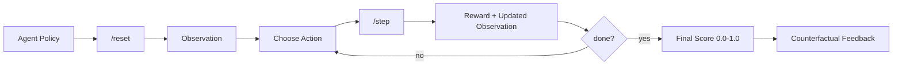
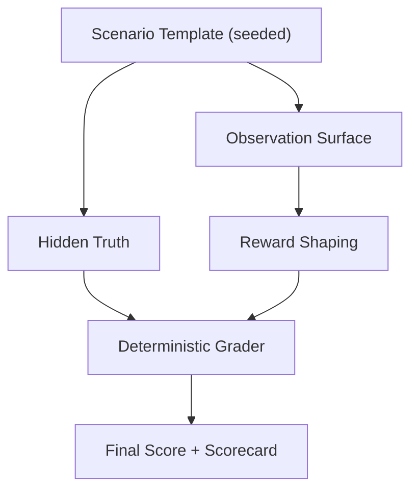
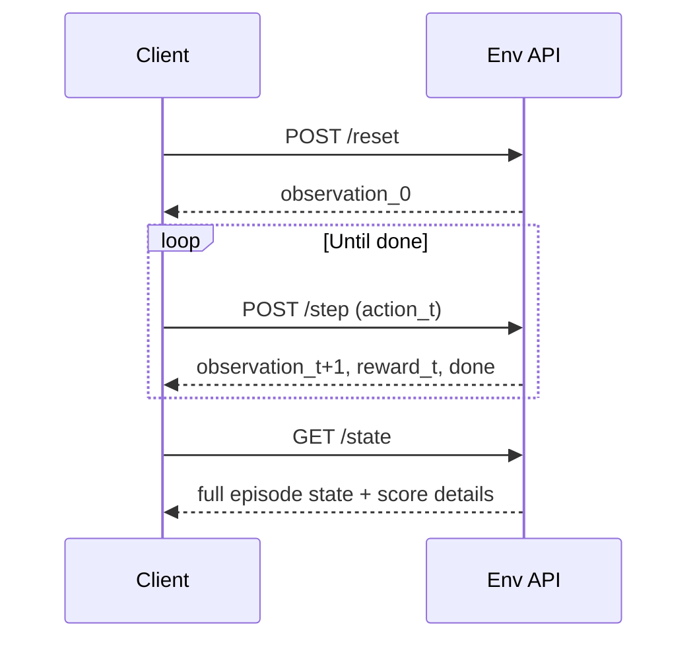

# SRE Incident Triage Env

## Problem
Modern SRE teams spend high-stakes minutes in incident triage deciding:
- what failed first,
- what is only a downstream symptom,
- how severe the incident is,
- and which mitigation is safest under error-budget pressure.

Most agent benchmarks do not model this operational workflow with deterministic, auditable scoring.

## Our Solution
We built a deterministic OpenEnv environment that simulates realistic incident response using synthetic:
- alerts,
- logs,
- traces,
- service metadata,
- and timeline events.

The agent must inspect evidence, classify severity, identify root cause, propose and execute mitigation, submit a postmortem, and close the incident. Rewards are shaped across the trajectory, and final grading is normalized to `[0.0, 1.0]`.

## How We Solved It
1. Built typed Pydantic contracts for `Observation`, `Action`, `State`, and `StepResult`.
2. Implemented deterministic scenario templates for `easy`, `medium`, `hard`, each with `public` and `holdout` splits.
3. Added step-wise reward shaping for useful evidence gathering and safe operations.
4. Implemented deterministic graders with weighted dimensions (root cause, severity, mitigation, trace evidence, safety, efficiency, postmortem quality).
5. Added OpenAI-client baseline inference with strict `[START]`, `[STEP]`, `[END]` logs.
6. Packaged as Docker Space with FastAPI endpoints and OpenEnv manifest.

## Why Companies Benefit
- **Incident readiness**: evaluate whether agents can triage production-style failures, not toy tasks.
- **Safety-aware automation**: scoring penalizes destructive or policy-violating mitigation.
- **Auditability**: deterministic scenarios and reproducible grading support governance and regression testing.
- **Training signal quality**: shaped reward provides dense feedback for RL/agent improvement.
- **Deployment realism**: API-first design mirrors real observability and incident tooling workflows.

## Architecture




## Deployed API
- Space: [HakashiKatake/sre-incident-triage-env](https://huggingface.co/spaces/HakashiKatake/sre-incident-triage-env)
- Base URL: [https://hakashikatake-sre-incident-triage-env.hf.space](https://hakashikatake-sre-incident-triage-env.hf.space)
- OpenAPI docs: [https://hakashikatake-sre-incident-triage-env.hf.space/docs](https://hakashikatake-sre-incident-triage-env.hf.space/docs)

### Endpoints
- `GET /`
- `GET /web`
- `GET /health`
- `POST /reset?difficulty={easy|medium|hard}&split={public|holdout}&seed=<int>`
- `POST /step` with JSON action body
- `GET /state`

### Quick API Test (Deployed)
```bash
BASE_URL="https://hakashikatake-sre-incident-triage-env.hf.space"

curl -s "$BASE_URL/health"
curl -s -X POST "$BASE_URL/reset?difficulty=easy&split=public&seed=11"
curl -s -X POST "$BASE_URL/step" -H "Content-Type: application/json" -d '{"action_type":"inspect_alerts"}'
curl -s "$BASE_URL/state"
```

## How To Run Inference From Deployed URL

### Option A: Deployed inference runner
Uses `OpenAI` client via `API_BASE_URL`, `MODEL_NAME`, and `HF_TOKEN`/`OPENAI_API_KEY`.

```bash
export API_BASE_URL="https://router.huggingface.co/v1"
export MODEL_NAME="meta-llama/Llama-3.1-8B-Instruct"
export HF_TOKEN="<your_token>"

python scripts/infer_deployed.py \
  --base-url "https://hakashikatake-sre-incident-triage-env.hf.space"
```

### Option B: Baseline submission script (local env loop)
Required hackathon baseline script with strict structured logs.

```bash
python inference.py
```

## Benchmark Tests

### Reproducible benchmark command
```bash
python scripts/benchmark_deployed.py \
  --base-url "https://hakashikatake-sre-incident-triage-env.hf.space" \
  --json-out outputs/benchmark_deployed.json
```

Raw report is written to `outputs/benchmark_deployed.json`.

### Measured stats (April 8, 2026, single run on deployed Space)

| Metric | Value |
|---|---:|
| Episodes | 6 |
| Mean score | 1.00 |
| Min/Max score | 1.00 / 1.00 |
| Mean steps per episode | 10.33 |
| `reset` latency p50 / p95 | 876.80 ms / 899.32 ms |
| `step` latency p50 / p95 | 870.60 ms / 1407.36 ms |
| `state` latency p50 / p95 | 897.59 ms / 1445.39 ms |

### Per-task results

| Task | Seed | Steps | Score | Reward Sum |
|---|---:|---:|---:|---:|
| easy_public | 11 | 10 | 1.00 | 1.66 |
| medium_public | 22 | 10 | 1.00 | 1.72 |
| hard_public | 33 | 11 | 1.00 | 1.78 |
| easy_holdout | 111 | 10 | 1.00 | 1.66 |
| medium_holdout | 122 | 10 | 1.00 | 1.72 |
| hard_holdout | 133 | 11 | 1.00 | 1.78 |



## Action Space
- `inspect_alerts`
- `inspect_timeline`
- `inspect_logs(service_name, limit)`
- `inspect_service_metadata(service_name)`
- `inspect_trace(trace_id)`
- `classify_severity(severity)`
- `identify_root_cause(service_name, cause_category, reason, runbook_id)`
- `recommend_mitigation(action, runbook_id)`
- `execute_mitigation(plan, justification)`
- `submit_postmortem(timeline_summary, root_cause, corrective_action, prevention_action, runbook_ids)`
- `close_incident(summary)`

## Tasks
- `easy`: single service incident, direct signature.
- `medium`: cascading failure, distinguish cause vs symptom.
- `hard`: distributed noisy failure, trace evidence is required for full score.

## Project Layout
```text
.
├── Dockerfile
├── openenv.yaml
├── inference.py
├── scripts
│   ├── infer_deployed.py
│   └── benchmark_deployed.py
├── src
│   ├── env.py
│   ├── grading.py
│   ├── models.py
│   ├── rewards.py
│   ├── scenarios.py
│   └── server.py
└── tests
    ├── test_env.py
    ├── test_grading.py
    ├── test_openenv_spec.py
    └── test_tasks.py
```

## Local Run
```bash
python3 -m venv .venv
source .venv/bin/activate
pip install -e .[dev]
uvicorn src.server:app --host 0.0.0.0 --port 7860
```

## Quality Gates
```bash
pytest -q
openenv validate
docker build -t sre-incident-triage-env .
```

## Determinism
- Scenario generation is seed-based and template-driven.
- Grading has no randomness.
- Reward shaping is deterministic.
- Environment runtime has no external API dependency.
- Same `(difficulty, split, seed)` produces identical incident truth and score behavior.
